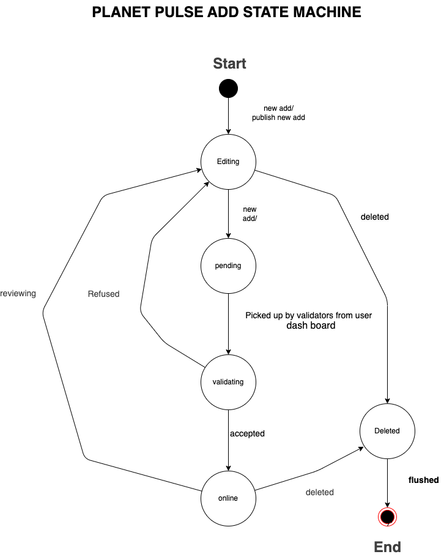

# Important Questions Product Owner:

This is a file that stores all important questions to be asked to the Product Owner.

## Design:
### Q1:

Pelo queentendi ao certo deveria retirar a secção de 'Destaque Recentes da *home page* ou pelo menos alterá-la, mas no Word de wireframes encontra-se nessa secção.  

Devo colocá-la ou coloco-a  na *Feed page*?

**Resposta:**  
A que secção te referes?  

Devemos ter na *homepage* uma secção com destaques, incluindo os últimos posts ou uma seleção aleatória. Estes *highlights* devem variar ao longo do tempo; não devem ser os mesmos por muito tempo.  
O ideal até seria que fossem sempre diferentes — por exemplo, sempre que se carrega a *homepage*, selecionarmos aleatoriamente 3 posts para esta secção, eventualmente atribuindo um peso que favoreça a seleção dos posts mais recentes.

---

### Q2:
Sendo dado pelo seguinte template de Word:  
Os posts da secção de destaques seguem a mesma estrutura visual que os posts da *Feed page*, certo?

**Resposta:**  
Os posts da secção de destaque são diferentes.  
São um resumo, um *teaser* que motive as pessoas a clicar e ver o post completo na *feed page*.  
A *Feed page* que referes é a página onde se podem visualizar todos os posts, e onde se podem selecionar e aplicar filtros, certo?

## Q3: A máquina de estados deve entrar no modelo de domínio?

**Pergunta:** Só para confirmar: a máquina de estados, não deve de forma nenhuma entrar no modelo de domínio, certo? (Pergunto somente devido ao processo de validação, que tentei já colocar algo a representar)

**Resposta:**  
A máquina de estados não deve estar no modelo de domínio. Cria um documento de design onde colocas esses artefatos (diagrama de classes, máquinas de estados, diagramas de sequência, …).

---

## Q5: É possível postar só uma ad com imagem, vídeo ou comentário?

**Resposta:**  
Não. Tem que ter sempre, pelo menos:
- Um título,
- Um snippet/sumário/teaser,
- O conteúdo em texto,
- Uma imagem e/ou um vídeo.

---

## Q6: Um comentário de feedback pode ser adicionado em qualquer estado?

**Pergunta:** Um Comentário de Feedback pode ser adicionado independentemente do estado da máquina de estados? Ou apenas quando transita do estado `pending` para `editing` (com um comentário de feedback)?

**Resposta:**  
Não pode. Os comentários de feedback são adicionados enquanto está no estado `pending` e são disponibilizados para os autores do ad quando este transita de `pending` para `editing`.

---

## Q7: É possível alterar a role já atribuída a um utilizador?

**Pergunta:** Ex: promover/rebaixar um utilizador? Algumas destas transições são possíveis?  
Exemplo:
- Admin → Professor?  
- Professor → Admin?

**Resposta:**  
Sim. O admin pode alterar a role de um utilizador.

---

## Q8: Durante o projeto, haverá sprints definidos?

**Pergunta:** Durante o Projeto, serão desenvolvidos e definidos sprints, certo? Identifiquei 5 como estão no Word dos wireframes e defini-os assim:  
Poderíamos de alguma forma fazer uma apresentação e retrospetiva no final de cada sprint?

**Resposta:**  
Podemos e devemos!  
Os sprints 1 e 2 estão bem.  
Nos sprints seguintes vamos começar por pegar no product backlog e selecionar as user stories a implementar no sprint que vai iniciar. Vamos fazer uma reunião para lançar cada sprint.

---

## Q9: A documentação deve ser em inglês ou português?
**Sugestão:** Irei fazer por base em inglês e depois integro um plugin que traduz tudo para a maioria das línguas.

**Resposta:**  
Ótimo. É essa a ideia.
---
l é o formato certo do Podcast? Está bem como no modelo de domínio?

**Pergunta:** A forma como tenho no modelo domínio está indexada na mensagem eletrónica?

**Resposta:**  
Essa é a forma como tenho descrito atualmente no modelo de domínio (imagem partilhada no e-mail).  
Parece-me bem para já. Também não sei muito bem o que deve conter um podcast.  
Seja como for, como está, está bem para já. Depois alteramos, se necessário, quando tivermos mais informação – ou seja, no sprint em que implementarmos esta feature.

## State Machine Status removal:
**Q10** Dada a seguinte máquina de Estados:
  

**Q11** When final version is delivered can it be added to project?.

Não vejo sentido em deixarmos estado de validação aqui, podeirmaos completamente remover o estado , ou faria sentido especificar o ato dos professor e adminsitrador irem a dashboard de todos as add pending , e editarem , aceitarem ou rejeitarem.

**Q12** Como funcionará ao certo a gamificação para os alunos?
**Q13** Os professores também podem aceitar/ remover alunos dos posts do site tal como os validadores?.

Note : New questions on beginning